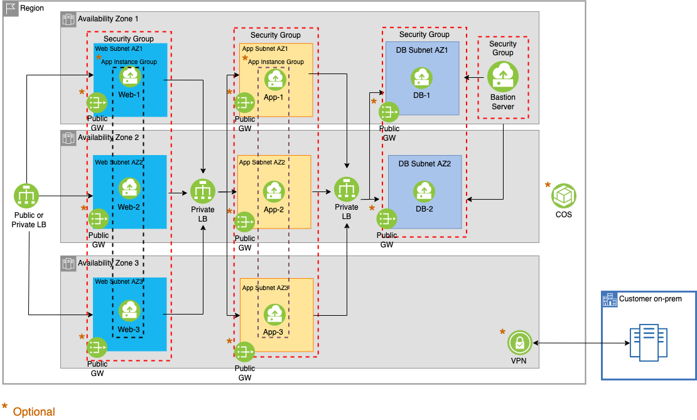

# Terraform automation script for an multi-zone region (MZR)

## Description

This solution provides an automated solution for deploying a resilient infrastructure for a 3-tier web application in a MZR.

The code contains modules to deploy the following IBM Cloud resources:

- VSIs
- LBaaS (public or private)
- subnets
- security groups
- VPN
- public gateway
- COS
- User-data to install LAMP stack. (optional)

Some features are user choice to opt-in to allow some customization to best fit to their application requirements.

## Architecture

The code is broken into two parts - core and optional modules. The core module is mandatory and consists of the following:

- VSIs with anti-affinity (placement groups) for each tier -- web, app, and DB
- DB has a secondary data volume.
- Bastion server with a floating IP for management and access to other VSIs
- Each tier is in their own private subnet with security groups.
- Both web and app tiers are front-end with an LBaaS

The optional module, just as the name says it, it is an opt-in. The user can enable the following resources per their requirement:

- Choice between public or private for the web LBaaS
- VPN (site-to-site) for on-prem connectivity to the VPC
- Autoscale to optimize VSI resource and cost for web and app tier.
- COS for unstructured storage or backup
- Public gateway for private subnets (web, app, and DB) for outbound traffic to the internet
- LAMP stack installation

## Input parameter file

Most edits are contained within the `example.userinput.auto.tfvars` file. You can enter the VSI image of choice or profile. The
secondary data volume size parameter for DB is located in the `db_variables.tf` For resources listed as optional, you do not need
to edit unless you have set it for true.

Security groups or LBaaS listening ports are configured with default ports (i.e., 22, 80, and 443). If additional modifications are
required, then it is recommended to do it after provisioning through IBM Cloud UI or CLI.

## Usage

1. Clone the gh repo to your machine.
2. Change directory to the location where you cloned the `vpc-ha-az` to.
3. Edit the `example.userinput.auto.tfvars`.
   1. The default size for the data volume for DB is 10GB. To change the size edit the parameter in the `db_variables.tf` file.
4. Issue `terraform init`.
5. Issue `terraform plan`.
6. Issue `terraform apply`.
7. To destroy
   1. The bastion server is protected for inadvertent deletion. You need to change the `prevent_destroy` parameter to `false`. It is located at `/.ha_saz_core_module/saz/core_modules/bastion_compute.tf`.
   2. Issue `terraform destroy`.

## Related Links

[Customizing a three-tier highly available infrastructure VPC in a multi-zone region with automation](https://cloud.ibm.com/docs/cloud-infrastructure?topic=cloud-infrastructure-create-three-tier-resilient-vpc-saz-modular&interface=terraform)
